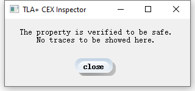
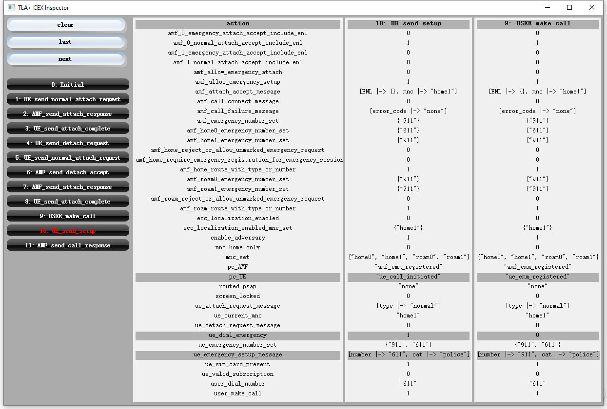

# Formal Cellular - Emergency Call

Formal specification for 3GPP cellular emergency call related protocols and systems in TLA+.

<!-- 
Requirements
------------

* [Python 3.6+](https://www.python.org/downloads/): for executing verification scripts in `elf` folder.
    * [wxPython 4.0.6](https://www.wxpython.org/pages/downloads/): for our GUI counterexample inspector
* [Java 8 (64-bit)](https://www.java.com/en/download/): for executing TLC Model Checker. -->

Specification Source Files
-----------

- [EmergencyCall_Model.tla](model/EmergencyCall_Model.tla): human-friendly, nonstandard TLA+ syntax, with comments.
    
- [EmergencyCall_Model_auto.tla](model/EmergencyCall_Model_auto.tla): TLC-friendly, auto generated, can be used by TLA+ Toolbox directly.
    

Installation
-----

    git clone https://github.com/FormalCellular/EmergencyCall EmergencyCall
    cd EmergencyCall/
    
    # Requirements
    # - python 3: for verification scripts in `elf` folder
    # - java 8 (64-bit): for TLC Model Checker
    # - wxPython 4: for our GUI counterexample inspector

#### Install wxPython

    # you may need to exit conda environment
    Windows and macOS: $ pip3 install -U wxPython 
    Ubuntu: $ sudo apt install python3-wxgtk4.0 
      
- Turn off GUI: using `-no-gui` option
     
 <!-- sudo apt install make gcc libgtk-3-dev libwebkitgtk-dev libwebkitgtk-3.0-dev libgstreamer-gl1.0-0 freeglut3 freeglut3-dev python-gst-1.0 python3-gst-1.0 libglib2.0-dev ubuntu-restricted-extras libgstreamer-plugins-base1.0-dev
  pip3 install -U wxPython -->    

Examples
----
#### Verify Failures: F1, F2, F3, F4
    
    python3 elf/main.py -cfg f1.cfg
    python3 elf/main.py -cfg f2.cfg
    python3 elf/main.py -cfg f3.cfg
    python3 elf/main.py -cfg f4.cfg

- Expected runtime: `3~5min` (`4`-core machine with `8GB` memory)

- Expected GUI output: [screenshot](elf/images/f1-output.png)

<!-- - Expected output: 
    
 -->

- To observe a trace of a successful emergency call, try:

      python3 elf/main.py -cfg s0.cfg

#### Discover Attack Traces: Attack1, Attack 2

    python3 elf/main.py -cfg attack1.cfg
    python3 elf/main.py -cfg attack2.cfg
    
- Expected runtime: `5~8min` (`4`-core machine with `8GB` memory: )

- Expected GUI output: [screenshot](elf/images/attack1-output.png)

<!-- 
- Expected output example for `Attack1`:  

-->

#### Skip Verification

You can skip verification and load our pre-generated TLC raw output directly. 
Try:

    python3 elf/main.py -raw f1_output.txt
    python3 elf/main.py -raw attack1_output.txt
    

    
Full Usage
----

    Usage: python3 elf/main.py <command> 
                  [-no-gui]  [-v]  [-worker num_workers]  [-memory memory_size]  [-output output_file] [-h] 
    example:
        python elf/main.py -cfg attack1.cfg
    command:
        -cfg config_file.cfg    verify predefined config file, in model/config folder
        OR
        -raw raw_output.txt     skip verification, load pre-generated TLC output, in model/raw_output folder
    options:
        -no-gui                 use this option if wxPython in not installed
        -v                      verbose CLI output
        -worker num_workers     number of CPU threads for verification
        -memory memory_size     memory allocated to Java heap (MB)
        -output output_file     specify raw output file for TLC results
        -h                      print usage

Advanced User
----
**Warning:** executing `elf/main.py` will always overwrite `model/EmergencyCall_Model_auto.py`.

#### Script Configuration 

All paths are defined in `elf/config.py`. Particularly, The TLC configure file `config_file.cfg` must be located in the same folder or a sub-folder of `model_file.tla`. It is required by the TLC model checker. The path of TLC output file `raw_output.txt` can be modified. We simply set the path to `model\raw_output.txt` for clarity.

#### Nonstandard TLA+ syntax in `EmergencyCall_Model.tla`

We used a nonstandard `UNCHANGED` syntax: `UNCHANGED << vars \ { list_of_changed_vars } >> ` to simplify the declare of `UNCHANGED` part in each transaction. 
Calling `python3 elf/main.py` will convert this nonstandard syntax to the standard TLA+ syntax.

If you want to change our model, we would recommend to change the `EmergencyCall_Model.tla` file, and using our parser to convert it.

#### Using TLA+ Toolbox

If you are familiar with the [TLA+ Toolbox](http://lamport.azurewebsites.net/tla/toolbox.html), you can simply create a New TLA+ Specification and set the Root-module file to `EmergencyCall_Model_auto.tla` to open and verify our model in the Toolbox. 
An example Model configuration is shown in this [screenshot](elf/images/TLA-Toolbox-Configuration.png).

License
-----

[MIT License](LICENSE)